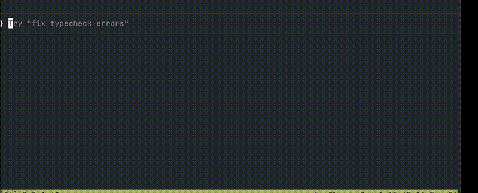

**English** | [日本語](README.ja.md)

# VoxBridge

[](https://github.com/keyiiiii/VoxBridge/actions/workflows/test.yml)
[](https://opensource.org/licenses/MIT)
[](https://github.com/keyiiiii/homebrew-tap)

A fully local voice input tool for macOS. Just hold a hotkey and speak — your words are transcribed, formatted, and typed into the active app. **All audio is processed locally and never sent over the network.**

## Features

- **Fully local processing** — Speech recognition (Whisper) and text formatting (Ollama) run entirely on-device
- **Self-contained .app** — Bundles Python.framework and all dependencies. Just copy and run
- **Live preview** — See real-time transcription in the overlay while recording
- **Translation mode** — Speak in one language, type in another (JA→EN / EN→JA) using a local LLM
- **Push-to-talk** — Records only while a modifier key (Option/Ctrl/Shift) is held
- **Menu bar controls** — Switch hotkey, STT model, and formatting on/off from the menu bar
- **Editable prompt** — Customize the formatting prompt to your liking; changes take effect immediately
- **Guided Ollama setup** — Install Ollama and download the model directly from the menu
- **Works with any app** — Pastes text into the active app via clipboard
- **Terminal-aware** — Automatically sends Enter in Terminal / iTerm2 etc.

## Demo

Voice input to [Claude Code](https://docs.anthropic.com/en/docs/claude-code) — just speak and your prompt is typed automatically:



## Architecture

```
┌─────────────────────────────────────────────────────────┐
│  VoxBridge.app (self-contained)                         │
│                                                         │
│  ┌──────────┐    ┌──────────┐    ┌──────────┐          │
│  │  Hotkey   │───>│ Recorder │───>│   STT    │          │
│  │(NSEvent  │    │(sound-   │    │(faster-  │          │
│  │ global   │    │ device)  │    │ whisper) │          │
│  │ monitor) │    │ 16kHz    │    │ small    │          │
│  └──────────┘    │ mono     │    └────┬─────┘          │
│                   └──────────┘         │ text           │
│  ┌──────────┐    ┌──────────┐    ┌────▼─────┐          │
│  │ Overlay  │    │ Injector │<───│Formatter │          │
│  │(NSPanel  │    │(Clipboard│    │(Ollama   │          │
│  │ status)  │    │ +Cmd+V + │    │ optional)│          │
│  └──────────┘    │ CGEvent) │    └──────────┘          │
│                   └────┬─────┘                          │
│                   ┌────▼────┐                           │
│                   │ Active  │                           │
│                   │  App    │                           │
│                   └─────────┘                           │
└─────────────────────────────────────────────────────────┘
```

## Requirements

- **macOS 14+** (Sonoma or later, Apple Silicon)
- **Ollama** (optional) — needed for text formatting and translation mode

### Ollama + Qwen 3 (Optional)

[Ollama](https://ollama.com/) is a local LLM server, and [Qwen 3](https://github.com/QwenLM/Qwen3) is an AI language model that runs on it. VoxBridge uses Qwen to clean up transcribed text — removing filler words ("um", "uh") and adding proper punctuation. **VoxBridge works without it** — formatting is skipped and raw STT output is used directly.

**From the menu bar (easiest):**

If Ollama is not detected, menu bar **VB** shows **Install Ollama...** — click to open the download page. After installing, if the model is not yet downloaded, **Download Qwen 3 model...** appears — click to download it in the background with progress shown in the overlay.

**Manual setup:**

1. Download and install Ollama from [ollama.com/download](https://ollama.com/download)
2. Launch the Ollama app (it runs in the menu bar)
3. Open Terminal and run:
   ```bash
   ollama pull qwen3:8b
   ```

**Homebrew (for developers):**

```bash
brew install ollama
ollama serve
ollama pull qwen3:8b
```

If Ollama is not installed or the server is not running, formatting is automatically disabled. You can toggle it from the menu bar (**VB** > **Formatting** > **Off / On**).

## macOS Permissions

VoxBridge requires the following macOS permissions. A dialog will appear on first launch.

| Permission | Required | Purpose | Without permission |
|------------|----------|---------|-------------------|
| **Microphone** | Required | Audio recording | Cannot record (app won't function) |
| **Accessibility** | Recommended | Global hotkey monitoring + text injection (Cmd+V, Enter) | Text is copied to clipboard but not auto-pasted. Manual Cmd+V required |

Settings location: **System Settings > Privacy & Security**

## Quick Start

### Install with Homebrew

```bash
brew tap keyiiiii/tap
brew install --cask voxbridge
```

To update:

```bash
brew upgrade --cask voxbridge
```

### Install from GitHub Releases

Download `VoxBridge-*-arm64.zip` from the [Releases page](https://github.com/keyiiiii/VoxBridge/releases/latest).

```bash
# Extract and place in /Applications
unzip VoxBridge-*-arm64.zip -d /Applications

# Launch
open /Applications/VoxBridge.app
```

> **Note**: Launching directly from the Downloads folder triggers macOS App Translocation, which runs the app from a temporary path and prevents Accessibility permissions from working properly. Always move the app to `/Applications` or your home folder before launching.

If Gatekeeper shows a warning on first launch, go to **System Settings > Privacy & Security > "Open Anyway"** to allow it.

When **VB** appears in the menu bar, the app is ready.

### Build from Source

```bash
git clone https://github.com/keyiiiii/VoxBridge.git
cd VoxBridge

# Build .app (bundles Python.framework + dependencies, takes a few minutes)
python3 scripts/build_app.py

# Launch
open dist/VoxBridge.app
```

Install directly to `/Applications` with `--install`:

```bash
python3 scripts/build_app.py --install
open /Applications/VoxBridge.app
```

### Run as CLI (Development)

```bash
python3 -m venv .venv
source .venv/bin/activate
pip install -r requirements.txt

python -m voxbridge --preload
```

## Usage

1. **Hold** the **Right Option key** (default) — recording starts ("Recording..." overlay)
2. While recording, a **live transcription preview** appears in the overlay
3. **Release** the key — recording stops → transcription → formatting → text is typed into the active app
4. In terminal apps (Terminal / iTerm2 etc.), Enter is sent automatically
5. Recording has a **60-second limit** (configurable) — a countdown appears in the last 10 seconds, and audio is auto-processed when the limit is reached

### Menu Bar

Click **VB** in the menu bar to access settings:

```
VoxBridge
─────────
Hotkey          ▶ Right Option / Left Option / ...
Speech Model    ▶ tiny / base / small / ...
Formatting      ▶ Off / On / Translate (JA → EN) / Translate (EN → JA)
─────────
Edit Formatting Prompt...
Install Ollama...          (shown when Ollama is not detected)
Download Qwen 3 model...     (shown when model is not downloaded)
─────────
Launch at Login
─────────
Quit
```

- **Formatting** — Toggle text formatting on/off, or switch to translation mode (JA→EN / EN→JA). Translation uses the local LLM to translate your speech into another language. Greyed out when Ollama or the model is unavailable.
- **Edit Formatting Prompt...** — Opens the prompt file (`~/Library/Application Support/VoxBridge/format_prompt.txt`) in your text editor. Changes take effect on the next voice input — no restart needed. The file is created from the bundled template on first launch and is never overwritten by updates.

Quit: Menu bar **VB** > **Quit**

Logs: `~/Library/Logs/VoxBridge.log`

## .app Structure

The built `VoxBridge.app` is self-contained (~400MB). Just copy it to another Mac and it works.

```
VoxBridge.app/Contents/
├── MacOS/VoxBridge              # Mach-O launcher (resolves via relative paths)
├── Frameworks/Python.framework/ # Python runtime
├── Resources/
│   ├── voxbridge/               # Python source code
│   ├── config.yaml              # Configuration file
│   ├── prompts/                 # LLM prompt templates
│   └── venv/                    # Python dependencies
└── Info.plist
```

**Bundled:**
- Python.framework (Python runtime)
- venv (faster-whisper, pyobjc, ollama, and other Python packages)
- VoxBridge source code and config files

**Not bundled (downloaded per machine):**
- **Whisper model** — Auto-downloaded on first launch to `~/.cache/huggingface/` (~500MB)
- **Ollama + LLM model** — Only needed for text formatting (works without it)

## Configuration

Most settings can be changed from the menu bar. For advanced options, edit `config.yaml` (for .app: `VoxBridge.app/Contents/Resources/config.yaml`).

```yaml
# Hotkey (modifier key name)
hotkey: "alt_r"       # Right Option (default)
# hotkey: "alt_l"     # Left Option
# hotkey: "ctrl_r"    # Right Control
# hotkey: "shift_r"   # Right Shift

# Speech recognition language
language: "ja"

# STT model (larger = more accurate but slower)
stt:
  model: "small"       # tiny / base / small / medium / large-v3
  compute_type: "int8" # int8 / float16 / float32

# Text formatting (Ollama)
formatter:
  enabled: true        # Set to false to skip formatting
  model: "qwen3:8b"  # Ollama model name

# Apps that receive Enter after text injection
injector:
  send_enter_for:
    - "Terminal"
    - "iTerm2"
    - "Alacritty"
    - "kitty"
    - "Warp"
```

## Troubleshooting

### Hotkey not responding

- Check **Accessibility** permission (System Settings > Privacy & Security > Accessibility)
- Add VoxBridge.app and restart

### Cannot record

- Check **Microphone** permission (System Settings > Privacy & Security > Microphone)
- Verify mic device: `python3 -c "import sounddevice; print(sounddevice.query_devices())"`

### Text not auto-typed

- Check **Accessibility** permission
- Without permission, text is copied to clipboard — paste manually with Cmd+V
- If the overlay shows "Copied (requires Accessibility)", permission has not been granted
- Make sure you're not launching from the Downloads folder (App Translocation prevents permissions from working)

### Ollama issues

```bash
# Check if Ollama is running
curl -s http://localhost:11434/api/tags | python3 -m json.tool

# Check if the model is downloaded
ollama list

# Re-download the model
ollama pull qwen3:8b
```

If Ollama is unavailable, formatting is automatically skipped — no errors occur.

### Slow input

- Change STT model to `"tiny"` from the menu bar (lower accuracy)
- Turn off formatting from **VB** > **Formatting** > **Off**
- The .app build has `--preload` enabled by default (eliminates first-use model load time)

### Whisper model download

Auto-downloaded on first launch. To pre-download manually:

```bash
python3 -c "from faster_whisper import WhisperModel; WhisperModel('small', device='cpu', compute_type='int8')"
```

## Release

Pushing a `v*` tag or manually triggering the workflow builds and creates a release. Homebrew tap is updated automatically.

```bash
# Option 1: Tag push
git tag v0.8.0
git push origin v0.8.0

# Option 2: Manual trigger via GitHub CLI
gh workflow run build-release.yml -f tag=v0.8.0
```

## Project Structure

```
VoxBridge/
├── README.md                   # English documentation
├── README.ja.md                # Japanese documentation
├── requirements.txt
├── config.yaml                 # Configuration file
├── CONTRIBUTING.md              # Contributing guidelines
├── prompts/
│   ├── format.txt              # Formatting prompt template
│   ├── translate_ja_en.txt     # Translation prompt (JA → EN)
│   └── translate_en_ja.txt     # Translation prompt (EN → JA)
├── resources/
│   └── icon.icns               # App icon (prebuilt)
├── scripts/
│   ├── build_app.py            # .app build script
│   └── launch.sh               # CLI launch helper
├── .github/
│   └── workflows/
│       ├── build-release.yml   # Release automation (tag push → build → GitHub Releases → Homebrew)
│       └── test.yml            # CI tests (push / PR)
├── voxbridge/
│   ├── __init__.py
│   ├── __main__.py             # Entry point
│   ├── app.py                  # Main app (NSEvent + AppDelegate)
│   ├── config.py               # Config loader
│   ├── recorder.py             # Audio recording (sounddevice)
│   ├── stt.py                  # Speech-to-text (faster-whisper)
│   ├── formatter.py            # Text formatting (Ollama, optional)
│   ├── injector.py             # Text injection (CGEvent + Clipboard)
│   └── overlay.py              # Overlay UI + menu bar (PyObjC)
└── tests/
    └── test_smoke.py           # Smoke tests
```

## License

MIT
